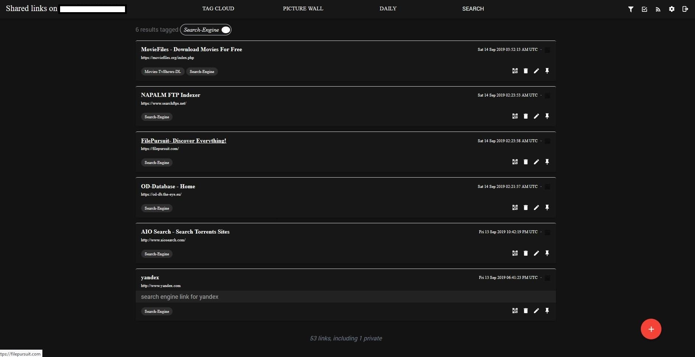

# shaarli-material-dark
darkened version of material theme for shaarli

First you will need to have material theme (download material theme [here](https://github.com/kalvn/Shaarli-Material)) applied then overwrite styles.min.css at <Your Shaarli Installation Dir/tpl/material/dist/> be sure to backup the original styles.min.css just in case you dont like the dark theme
-
(right click on image and select view image to get a better view)

# December 5th Update -
Fixed dropdown menus in settings > configuration 
 
And changed the background where a thumbnail is to match the theme
