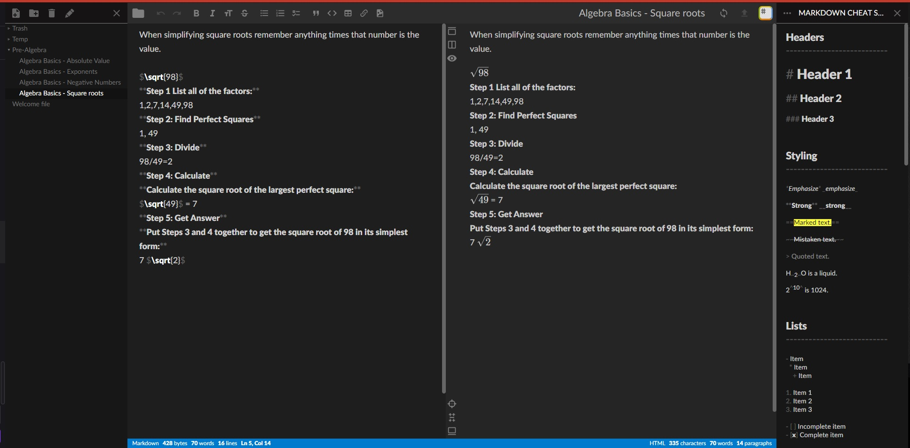

This style builds  upon the dark mode within stack edit 

To use this first make sure you have dark mode enabled
by going to the right menu  of the editor > settings
then add colorTheme: dark
press ok. 

then using stylus(google chrome extension)
write new style as usercss and copy everything from style.css into there.
</img>
